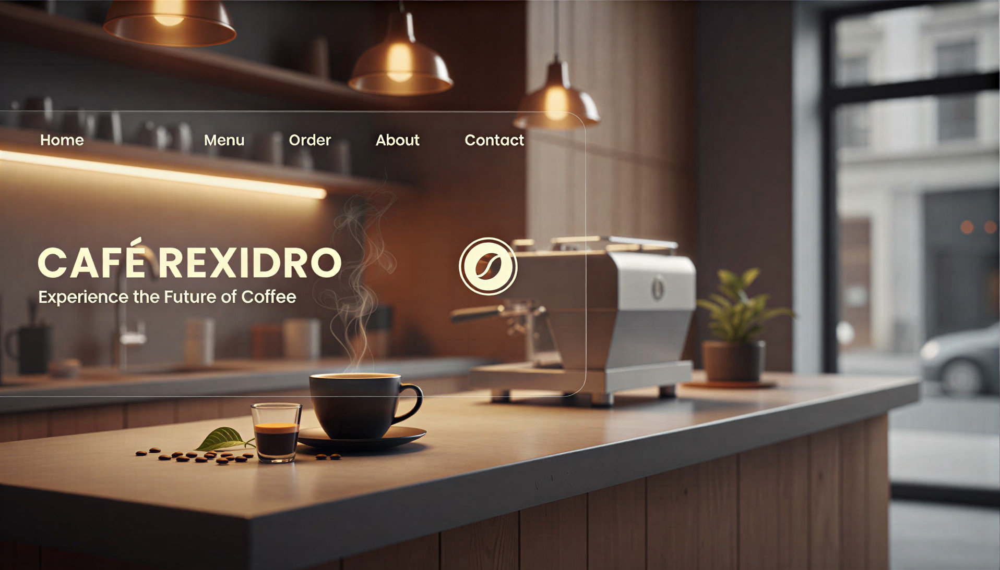

# ☕ کافه رکسیدرو | Cafe Rexidro

**کافه رکسیدرو** یک وب‌سایت مدرن و واکنش‌گرا در حوزه کافه و کافی‌شاپ آنلاین است که با استفاده از **React** و **Tailwind CSS** طراحی و پیاده‌سازی شده است.  
این پروژه به‌عنوان یک نمونه‌کار فرانت‌اند، تجربه یک کافه آنلاین را به‌صورت چندصفحه‌ای (SPA) ارائه می‌دهد.

🌐 **نسخه آنلاین وب‌سایت:**  
https://cafe-rexidro.vercel.app/


---

## 🖼️ پوستر

<p align="center">
  
</p>

---

## 📖 معرفی پروژه

وب‌سایت کافه رکسیدرو با هدف نمایش یک کافه مدرن و ارائه امکان سفارش قهوه به‌صورت آنلاین طراحی شده است.  
در این پروژه تمرکز اصلی بر روی طراحی رابط کاربری تمیز، تجربه کاربری مناسب و مسیریابی روان بین صفحات بوده است.

این پروژه می‌تواند به‌عنوان یک نمونه‌کار مناسب برای توسعه‌دهندگان فرانت‌اند React مورد استفاده قرار گیرد.

---

## 🧩 صفحات وب‌سایت

وب‌سایت شامل صفحات زیر است:

- **کافه ما (صفحه اصلی / Landing Page)**  
  معرفی کافه رکسیدرو، فضای کلی و هویت برند

- **سفارش قهوه**  
  نمایش محصولات و بخش فروش قهوه به‌صورت آنلاین

- **درباره ما**  
  معرفی داستان، اهداف و چشم‌انداز کافه

- **ورود و ثبت‌نام**  
  صفحات رابط کاربری مربوط به احراز هویت کاربران

تمامی صفحات با استفاده از **React Router** به‌صورت کلاینت‌ساید مسیریابی شده‌اند.

---

## 🛠️ تکنولوژی‌ها و ابزارها

- **React.js**
- **Tailwind CSS**
- **React Router DOM**
- **Vite**
- **Vercel (برای دیپلوی)**

---

## 🚀 اجرای پروژه به‌صورت محلی

برای اجرای پروژه روی سیستم خود، مراحل زیر را انجام دهید:

```bash
git clone https://github.com/WebRezaSeyyednezhad/Cafe-Rexidro.git
cd Cafe-Rexidro
npm install
npm run dev
```
سپس پروژه روی آدرس محلی اجرا خواهد شد.

---

## 📸 تصاویر پروژه (Screenshots)

<p align="center">
  
</p>

نسخه آنلاین پروژه در دسترس است:
👉 https://cafe-rexidro.vercel.app/


---

## 📌 وضعیت پروژه

این پروژه در حال حاضر تکمیل شده و به‌صورت آنلاین منتشر شده است.
در نسخه‌های بعدی امکان توسعه قابلیت‌های زیر وجود دارد:

- **اتصال به بک‌اند**
- **سبد خرید**
- **درگاه پرداخت**
- **پنل کاربری**

---

## 👤 توسعه‌دهنده

- *رضا سید‌نژاد*
- *توسعه‌دهنده فرانت‌اند*

GitHub: https://github.com/WebRezaSeyyednezhad

---
---

# ☕ Cafe Rexidro

**Cafe Rexidro** is a modern and responsive cafe & online coffee shop website built with **React** and **Tailwind CSS**.  
This project represents a digital platform for a cafe, allowing users to explore the cafe, order coffee online, and manage authentication through login and registration pages.

🌐 **Live Demo:**  
  - **https://cafe-rexidro.vercel.app/**

---

## 🖼️ Cover

<p align="center">
  
</p>

---

## 📖 About the Project

Cafe Rexidro is designed as a multi-page web application for an online café experience.  
The website focuses on clean UI, smooth navigation, and a modern user experience.

The project includes:
- A landing page introducing the cafe
- An online coffee ordering section
- About Us page
- Login & Register pages
- Client-side routing using React Router

This project is suitable as a portfolio piece for frontend development using React.

---

## 🧩 Pages & Features

- **Cafe Ma (Landing Page)**  
  Introduction to Cafe Rexidro and its atmosphere

- **Order Coffee (Sefarsh Ghahve)**  
  Coffee products section for online ordering

- **About Us**  
  Information about the cafe brand and vision

- **Login & Register**  
  User authentication UI pages

---

## 🛠️ Tech Stack

- **React.js**
- **Tailwind CSS**
- **React Router DOM**
- **Vite**
- **Vercel (Deployment)**

---

## 🚀 Getting Started

To run this project locally:

```bash
git clone https://github.com/WebRezaSeyyednezhad/Cafe-Rexidro.git
cd Cafe-Rexidro
npm install
npm run dev
```

---

## 📸 Screenshots

<p align="center">
  
</p>


You can view the live version of the website here:
- **👉 https://cafe-rexidro.vercel.app/**

---

## 📌 Project Status

- This project is currently completed and deployed.
- Future improvements may include:
  - **Backend integration**
  - **Shopping cart functionality**
  - **Payment gateway**
  - **User dashboard**

---

## 👤 Developer

- **Reza Seyyednezhad**
- **Frontend Developer**

GitHub: https://github.com/WebRezaSeyyednezhad
